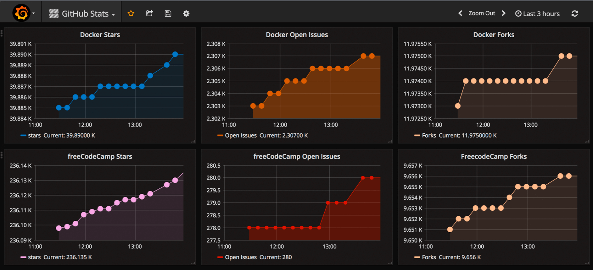
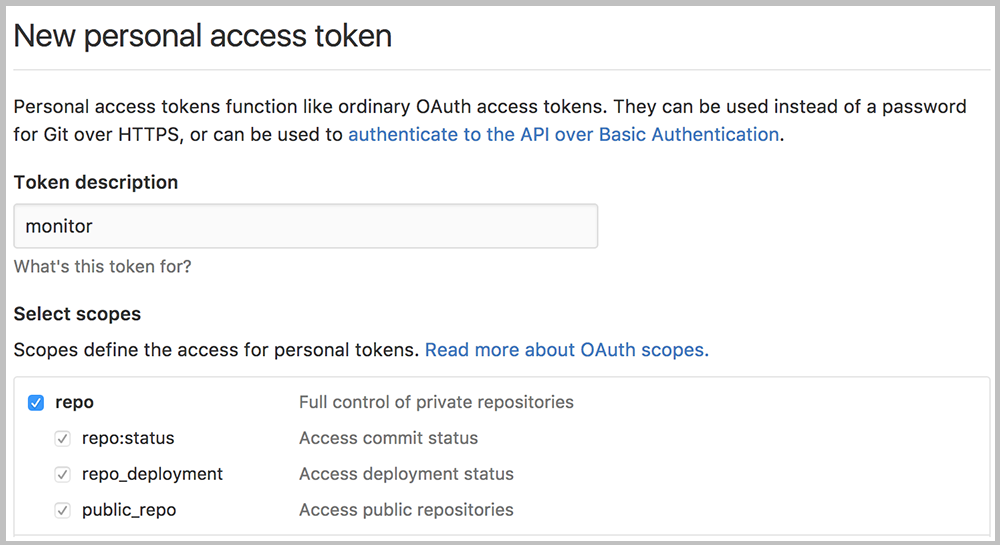
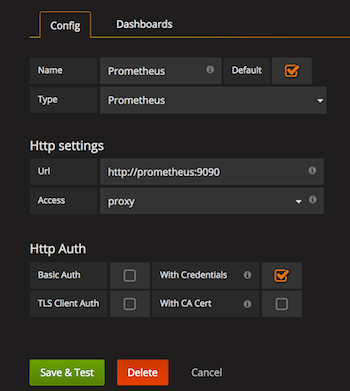
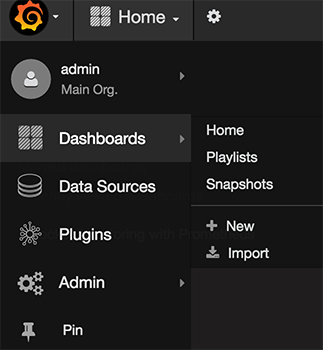

[](https://github.com/mariano-tp/github-observability-demo/actions/workflows/compose-validate.yml)
[](https://github.com/mariano-tp/github-observability-demo/releases)
[](./LICENSE)
[](https://github.com/mariano-tp/github-observability-demo/commits/main)
[](https://github.com/mariano-tp/github-observability-demo/stargazers)


# GitHub Observability Demo

Demo de observabilidad para métricas de **GitHub** usando **Prometheus + Grafana + github-exporter**.  
Pensado para mostrar prácticas de **observabilidad** y **CI en GitHub Actions**, sin instalar nada en tu PC.

> Basado en trabajo de la comunidad (github-monitoring). Este fork se usa con fines educativos.

## ¿Qué incluye?
- **Prometheus** scrapea métricas del exporter de GitHub.
- **Grafana** con dashboard de estadísticas (stars, forks, issues) de repos de ejemplo.
- **CI**: workflow `compose-validate` que valida `docker-compose.yml` en cada push/PR.

## Estructura
```
.
├─ grafana/          # dashboards y provisión
├─ prometheus/       # configuración de Prometheus
├─ images/           # capturas usadas en este README
├─ docker-compose.yml
└─ config.monitoring # variables de ejemplo (REPOS, etc.)
```

## Cómo corre (opcional)
No es necesario para revisar el código ni el CI.  
Si alguien quiere ejecutarlo localmente con Docker Compose:

1. Crear un **Personal Access Token** de GitHub (PAT) con alcance `public_repo` (o `repo` si hay privados).
2. Definir variables:
   - `REPOS` (coma-separado, p. ej. `freeCodeCamp/freeCodeCamp,docker/docker`)
   - `GITHUB_TOKEN` (tu PAT)
3. Levantar:
```bash
docker compose up -d
```

- Grafana: `http://localhost:3000` (usuario `admin`, contraseña definida en `config.monitoring`)  
- Prometheus: `http://localhost:9090`

## Capturas
**Dashboard**  


**Token de GitHub (PAT)**  


**Datasource en Grafana**  


**Importar dashboard**  


## CI (GitHub Actions)
Este repositorio ejecuta automáticamente:
- `docker compose -f docker-compose.yml config` → valida sintaxis y referencias.

## Créditos
- Stack original de la comunidad (github-monitoring) + ajustes de presentación y CI por @mariano-tp.

Ver también: [Código de Conducta](./.github/CODE_OF_CONDUCT.md)
